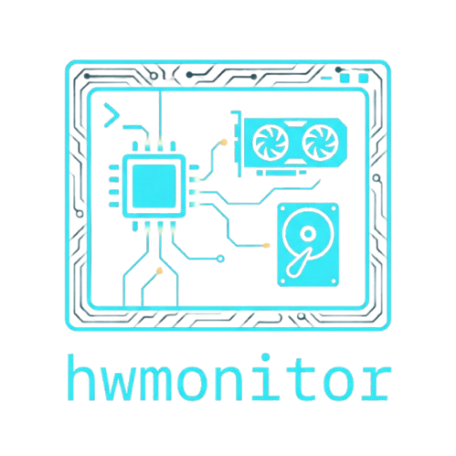

<p align="center">
  
</p>

# hwmonitor

> A minimalist, high-performance hardware discovery engine for Linux systems.

**hwmonitor** is a lightweight, low-dependency (C11) command-line utility designed for developers and system administrators who require structured, low-latency hardware telemetry. Rather than relying on expensive external shell calls (`lspci`, `dmidecode`, or `lshw`), **hwmonitor** interfaces directly with the Linux kernel via `/sys` and `/proc` filesystems.

It provides both beautiful, human-readable terminal output and highly structured JSON for modern monitoring stacks and API integrations.

---

## ✨ Key Features

* **Native Performance:** Written in pure C. Direct kernel filesystem parsing ensures near-instant execution times.
* **🤖 AI Hardware Consultant:** Built-in integration with the Groq API allows you to ask natural language questions about your hardware (e.g., bottlenecks, linux driver compatibility) directly from the terminal.
* **JSON-First Architecture:** Built-in serialization for seamless integration into dashboards, observability pipelines, or scripts.
* **Comprehensive Hardware Discovery:** Advanced logic for CPU, RAM, Multi-GPU configurations, Storage (block devices), Mainboard (DMI/SMBIOS), Battery, and OS environments.
* **Zero Bloat:** No Python, no `dbus`. Uses `libcurl` for AI network requests and a single submodule ([cJSON](https://github.com/DaveGamble/cJSON)) for reliable JSON generation.
* **Memory Safe:** Engineered with an "inside-out" deep-freeing pattern to ensure a zero-leak footprint.

---

## 🚀 Installation

The project uses Git submodules and requires `libcurl` for AI integrations.

### 1. Install Dependencies
* **Debian / Ubuntu:** `sudo apt install build-essential libcurl4-openssl-dev`
* **Arch Linux:** `sudo pacman -S base-devel curl`
* **Fedora / RHEL:** `sudo dnf install gcc make libcurl-devel`

### 2. Build and Install
Ensure you perform a recursive clone to include all necessary dependencies.

```bash
git clone --recursive https://github.com/th0truth/hwmonitor.git
cd hwmonitor
make
sudo make install
```

Once installed, you can run `hwmonitor` from anywhere in your terminal!

---

## 🛠️ Usage

**hwmonitor** supports a flexible command-line interface. By default, running it without flags will display all available hardware modules.

### 🤖 AI Hardware Consultant

You can ask an LLM (powered by Groq's API) specific questions about your hardware. Simply set your API key and append the `-A` flag!

```bash
# Set your API token
export GROQ_API_KEY="gsk_your_api_token"

# Analyze specific hardware
hwmonitor --gpu -A "What is the best open-source driver branch for this GPU on Wayland?"

# Analyze the entire system
hwmonitor --all -A "I want to run a local Kubernetes cluster. Are there any bottlenecks here?"
```

*(Optional): You can override the default AI model (`llama-3.1-8b-instant`) by exporting `GROQ_MODEL="llama-3.3-70b-versatile"`.*

```bash
# Display full system report in the terminal
hwmonitor

# Generate a full system report in structured JSON
hwmonitor --json

# Export specific CPU and Storage metrics to a file
hwmonitor --cpu --storage --json --output report.json
```

### Available Flags

| Flag | Long Flag | Description |
| :--- | :--- | :--- |
| `-O` | `--os` | Retrieves Operating System and Desktop Environment details. |
| `-m` | `--mainboard` | Shows Mainboard/System DMI information (Run with `sudo` for Serial). |
| `-c` | `--cpu` | Collects architecture, cores, and real-time frequency data. |
| `-r` | `--ram` | Reports detailed memory utilization, cache, and swap metrics. |
| `-s` | `--storage` | Discovers block devices (NVMe, SSD, HDD) and their capacities. |
| `-g` | `--gpu` | Performs dynamic bus scanning for all installed GPUs. |
| `-b` | `--battery` | Monitors capacity, voltage, and health of system batteries. |
| `-n` | `--network` | Lists network interfaces, drivers, and PCI bus topology. |
| `-a` | `--all` | Explicitly targets all hardware modules. |
| `-j` | `--json` | Serializes hardware data into a JSON object. |
| `-o` | `--output <file>`| Redirects the JSON output to a specified file. |
| `-A` | `--ai <prompt>`| Sends hardware data to Groq AI to answer your prompt. |
| `-h` | `--help` | Displays the help menu. |

---

## 📊 Sample Output

### Terminal (Human-Readable)

When running in standard mode, **hwmonitor** dynamically formats beautiful, colorized ASCII-boxed hardware reports.

```text
╭─ Operating System (OS) 
│  Name            : Nebula Linux LTS
│  ID              : nebula
╰─

╭─ Mainboard / System 
│  Sys Vendor      : TechCorp Systems
│  Product Name    : ComputeServer X900
│  Board Vendor    : TechCorp Motherboards Inc.
│  Board Name      : ServerBoard Z99
╰─

╭─ Central Processing Unit (CPU) 
│  Vendor          : QuantumSilicon
│  Model           : QuantumCore Processor X9
│  Arch            : x86_64
│  Cores           : 16 Physical / 32 Logical
│  Frequency       : 800.00 MHz - 4200.00 MHz
╰─

╭─ Graphics Processing Unit [0] 
│  Vendor          : 0x10de (0x39a0)
│  Model           : TitanFlow Compute Accelerator
│  PCI Slot        : 0000:01:00.0
│  Bus Type        : PCIe
│  Driver          : titan
╰─

╭─ Storage Device [0] (nvme0n1) 
│  Model           : HyperDrive NVMe Pro
│  Size            : 1907.73 GiB
│  Removable       : No
│  PCI Slot        : 0000:04:00.0
╰─

╭─ Network Interface [0] (eth0) 
│  Driver          : igc
│  PCI ID          : 8086:15f3
│  PCI Slot        : 0000:05:00.0
│  PCI Subsys ID   : 1043:87d2
╰─
```

### AI Hardware Analysis

When using the `--ai` flag alongside hardware targets (e.g., `--gpu`), the tool sends a structured payload to Groq and parses the response directly into your terminal.

```text
$ hwmonitor --gpu -A "Is this GPU good for local AI inference?"

╭─ AI Hardware Analysis (Groq) 
│ Yes, the TitanFlow Compute Accelerator is an excellent GPU for local AI inference.
│ Based on its PCIe bus type and the proprietary 'titan' driver, it has full
│ support for hardware acceleration on Nebula Linux. However, depending on the
│ VRAM capacity, you may be limited to models under 13B parameters unless you 
│ apply quantization (INT4 or INT8).
╰─
```

### JSON (Machine-Readable)

Using the `--json` flag produces a highly structured schema ready for parsing.

```json
{
  "os": {
    "name": "Nebula Linux LTS",
    "id": "nebula"
  },
  "mainboard": {
    "sys_vendor": "TechCorp Systems",
    "product_name": "ComputeServer X900",
    "board_vendor": "TechCorp Motherboards Inc.",
    "board_name": "ServerBoard Z99"
  },
  "cpu": {
    "vendor": "QuantumSilicon",
    "model_name": "QuantumCore Processor X9",
    "arch": "x86_64",
    "online_cores": 32,
    "max_freq_mhz": 4200
  },
  "gpus": [
    {
      "vendor": "0x10de",
      "model": "TitanFlow Compute Accelerator",
      "driver": "titan",
      "pci_id": "0000:01:00.0"
    }
  ],
  "storages": [
    {
      "device": "nvme0n1",
      "size_bytes": 2048408248320,
      "removable": false,
      "model": "HyperDrive NVMe Pro",
      "pci_slot_name": "0000:04:00.0"
    }
  ],
  "networks": [
    {
      "interface": "eth0",
      "driver": "igc",
      "pci_id": "8086:15f3",
      "pci_slot_name": "0000:05:00.0",
      "pci_subsys_id": "1043:87d2"
    }
  ]
}
```

---

## 📄 License

This project is licensed under the **MIT License**. See the `LICENSE` file for details.
