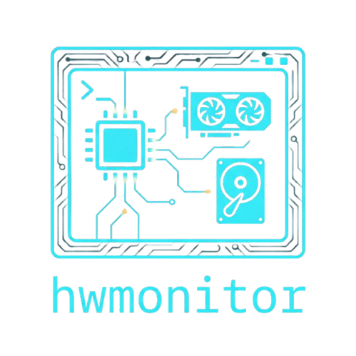

<p align="center">
  
</p>

# hwmonitor

Lightweight hardware discovery and telemetry engine for Linux systems written in C11.

## Overview

`hwmonitor` directly inspects Linux `/sys` and `/proc` kernel interfaces to extract hardware specifications without subprocess overhead from utilities like `lspci`, `dmidecode`, or `lshw`. It supports ANSI terminal formatting, structured JSON output, and AI-driven telemetry diagnostics powered by the Groq API.

## Features

- **Direct Kernel Querying**: Direct parsing of `sysfs` and `procfs` for minimal overhead and low latency.
- **Hardware Coverage**: CPU, RAM, Multi-GPU configurations, Storage (NVMe, SSD, HDD), Mainboard (DMI/SMBIOS), Network interfaces, Battery, and OS info.
- **Output Modes**: Formatted terminal output with ANSI color styling or structured JSON.
- **Live Watch Mode**: Real-time periodic monitoring (`--watch`).
- **AI Diagnostics**: Natural language telemetry analysis powered by Groq API (`--ai`).
- **Zero Heavy Dependencies**: Pure C11 codebase with embedded `cJSON` and `libcurl` for API requests.

## Requirements and Build

### Dependencies

- C compatible compiler (`gcc` or `clang`)
- `make`
- `libcurl`

Install dependencies:

```bash
# Debian / Ubuntu
sudo apt install build-essential libcurl4-openssl-dev

# Arch Linux
sudo pacman -S base-devel curl

# Fedora / RHEL
sudo dnf install gcc make libcurl-devel
```

### Build and Install

```bash
git clone https://github.com/th0truth/hwmonitor.git
cd hwmonitor
make
sudo make install
```

### Test Suite

```bash
make test
```

## Usage

```
hwmonitor [options]

Options:
  -a, --all               Show all hardware information (default)
  -b, --battery           Show battery status and health
  -c, --cpu               Show CPU topology and frequency
  -g, --gpu               Show GPU details and driver info
  -m, --mainboard         Show mainboard and DMI system info
  -n, --network           Show network interfaces and PCI bus info
  -O, --os                Show operating system and desktop environment
  -r, --ram               Show RAM, cache, and swap statistics
  -s, --storage           Show storage drives and block devices
  -j, --json              Output in JSON format
  -o, --output <file>     Save JSON output to specified file
  -w, --watch             Live refresh every second
  -A, --ai <prompt>       Analyze hardware telemetry using Groq AI
  -h, --help              Show usage information
```

## Examples

### Terminal Overview

```bash
# Show CPU and RAM
hwmonitor --cpu --ram

# Continuous real-time monitoring
hwmonitor --cpu --ram --watch
```

### JSON Export

```bash
# Print hardware snapshot in JSON format
hwmonitor --all --json

# Save system report to file
hwmonitor --all --output report.json
```

### AI Diagnostics

```bash
export GROQ_API_KEY="gsk_..."

# Ask Groq AI about hardware compatibility or bottlenecks
hwmonitor --gpu -A "What is the recommended Linux driver for this GPU?"
```

## Output Formats

### Terminal

```text
╭─ Central Processing Unit (CPU) 
| Vendor          : AuthenticAMD
| Model           : AMD Ryzen 7 7800X3D 8-Core Processor
| Arch            : x86_64
| Cores           : 8 Physical / 16 Logical
| Frequency       : 4200.00 MHz - 5050.00 MHz
╰─

╭─ Random Access Memory (RAM) 
| Total           : 31.18 GiB
| Free            : 18.45 GiB
| Used            : 7.22 GiB (23.2%)
| Available       : 22.96 GiB
| Buff/Cache      : 5.51 GiB
| Swap Total      : 8.00 GiB
| Swap Free       : 8.00 GiB
╰─
```

### JSON

```json
{
  "schema_version": 1,
  "tool": "hwmonitor",
  "cpu": {
    "vendor": "AuthenticAMD",
    "model_name": "AMD Ryzen 7 7800X3D 8-Core Processor",
    "arch": "x86_64",
    "total_cores": 8,
    "total_threads": 16
  }
}
```

## License

MIT License. See [LICENSE](LICENSE) for details.
